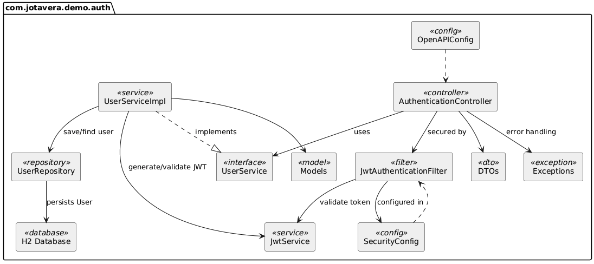
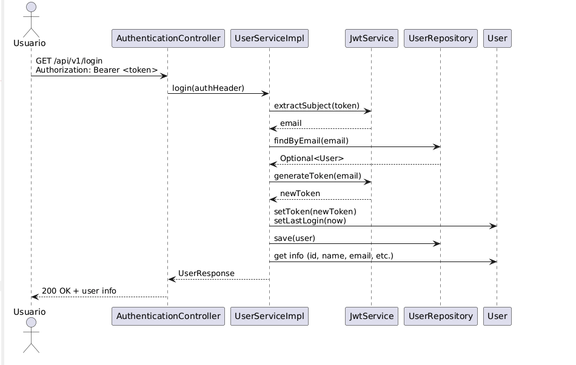
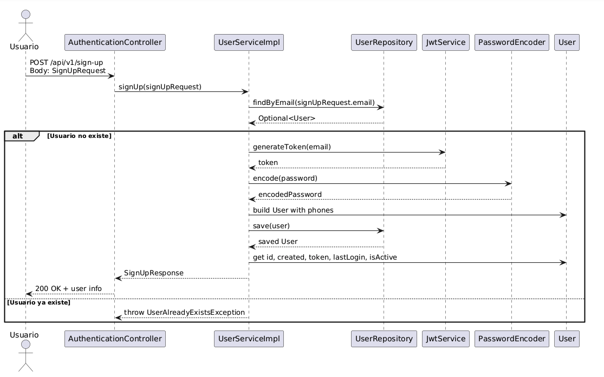

# API de Autenticación - Spring Boot con JWT y Swagger

Este proyecto es una API de autenticación desarrollada con Spring Boot 2.5.14, que utiliza JWT para autenticación, H2 como base de datos en memoria, y documentación automática con Swagger (OpenAPI).

## Características

- Registro de usuarios con validaciones y almacenamiento en H2.
- Autenticación mediante token JWT.
- Seguridad basada en filtros personalizados.
- Manejo global de excepciones (400, 401, 409, 500).
- Documentación Swagger accesible desde `/swagger-ui/index.html`.

## 🧩 Component Diagram



## 🔁 Sequence Diagram
Login


Sign-Up


## Endpoints

### POST `/api/v1/sign-up`

Registra un nuevo usuario.

**Body de ejemplo:**
```json
{
  "name": "Julio Gonzalez",
  "email": "julio@test.cl",
  "password": "a2asfGfdfdf4",
  "phones": [
    {
      "number": 87650009,
      "citycode": "1",
      "contrycode": "56"
    }
  ]
}
```

**Respuestas:**
- 200 OK – Usuario registrado exitosamente.
- 400 Bad Request – Error de validación.
- 409 Conflict – El usuario ya existe.

---

### GET `/api/v1/login`

Obtiene los datos del usuario a partir del token JWT enviado en el header `Authorization`.

**Headers:**
```
Authorization: Bearer {token}
```

**Respuestas:**
- 200 OK – Usuario autenticado.
- 401 Unauthorized – Token inválido o expirado.

---

## Accesos

- Swagger UI: [http://localhost:8080/swagger-ui/index.html](http://localhost:8080/swagger-ui/index.html)
- Consola H2: [http://localhost:8080/h2-console](http://localhost:8080/h2-console)
    - JDBC URL: `jdbc:h2:mem:testdb`
    - Usuario: `sa`
    - Contraseña: `password`

---

## Levantar el proyecto

### Requisitos

- Java 11
- Gradle 7.4

### Ejecutar localmente

```bash
./gradlew bootRun
```

La aplicación estará disponible en: `http://localhost:8080`

---

## Ejecutar los tests

```bash
./gradlew test
```

---

## Seguridad

- Algunas rutas públicas como `/api/v1/sign-up`, `/swagger-ui/**`, `/v3/api-docs/**`
- Rutas protegidas requieren el token JWT válido en el header `Authorization`.

---
Coverage

## Cobertura de Código con JaCoCo

Este proyecto utiliza **JaCoCo** para medir la cobertura de pruebas automatizadas.

### Comando para generar el reporte

Ejecuta el siguiente comando en la raíz del proyecto:

```bash
./gradlew clean test jacocoTestReport
```

Esto ejecutará las pruebas y generará un reporte HTML con los resultados de cobertura.

### Ver el reporte

Puedes abrir el reporte en tu navegador desde la siguiente ruta:

```
build/reports/jacoco/test/html/index.html
```

### Requisito mínimo

> ⚠️ **Cobertura mínima requerida: 80%**

Para cumplir con los estándares del proyecto, se requiere una cobertura de código del **80% o superior**.

---

## Autor

Desarrollado por Jesús Vera.
